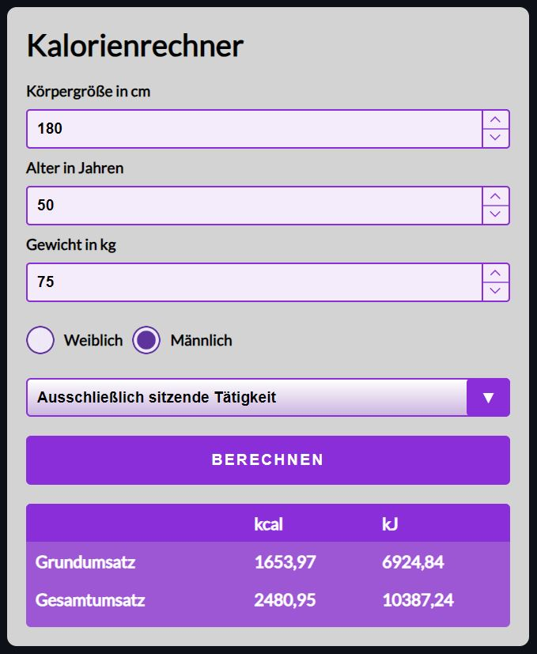

# Kalorien-Rechner – JavaScript-Projekt

## Beschreibung

Dieses JavaScript-Projekt wurde im Rahmen eines Coding-Bootcamps bei supercode.de erstellt. Es handelt sich um einen Kalorien-Rechner, der es ermöglicht, den Grundumsatz und den Gesamtumsatz von Frauen und Männern berechnen zu können.

Die Anwendung bietet die Möglichkeit, die folgenden Berechnungen durchzuführen:

- Grundumsatz in Kilokalorien (kcal) und Kilojoule (kJ)
- Gesamtumsatz in Kilokalorien (kcal) und Kilojoule (kJ)

Der Grundumsatz wird anhand der Harris Benedict Formel berechnet:
- Grundumsatz bei Männern: (Kalorien je Tag) 66.47 + (13.7 * Körpergewicht in kg) + (5 * Körpergröße in cm) – (6.8 * Alter in Jahren) = Grundumsatz
- Grundumsatz bei Frauen: (Kalorien je Tag) 655.1 + (9.6 * Körpergewicht in kg) + (1.8 * Körpergröße in cm) – (4.7 * Alter in Jahren) = Grundumsatz

Der Gesamtumsatz wird über den PAL-Faktor (PAL = Physical Activity Level) berechnet, indem man den Grundumsatz mit dem entsprechenden PAL-Faktor multipliziert.

## Funktionsweise

1. Gib deine Körpergröße in cm an.
2. Gib dein Alter in Jahren an.
3. Gib dein Gewicht in kg an.
4. Wähle aus, ob du weiblich oder männlich ist.
5. Gib deine tägliche körperliche Belastung an.
6. Klicke auf den Berechnen-Button, um die Ergebnisse anzeigen zu lassen.

## Screenshots

## GitHub Repository

Du findest das gesamte Projekt auf GitHub: [GitHub Repository](https://w1tch3r-code.github.io/js_kalorien_rechner/)

## Anmerkungen

- Dieses Projekt wurde im Rahmen eines Coding-Bootcamps bei supercode.de erstellt.
- Die Anwendung ermöglicht eine einfache und schnelle Berechnung des Grund- und Gesamtumsatzes von Frauen und Männern.
- Die README.md-Datei dient auch als Bewerbungsunterlage und präsentiert meine Fähigkeiten in der Webentwicklung.
